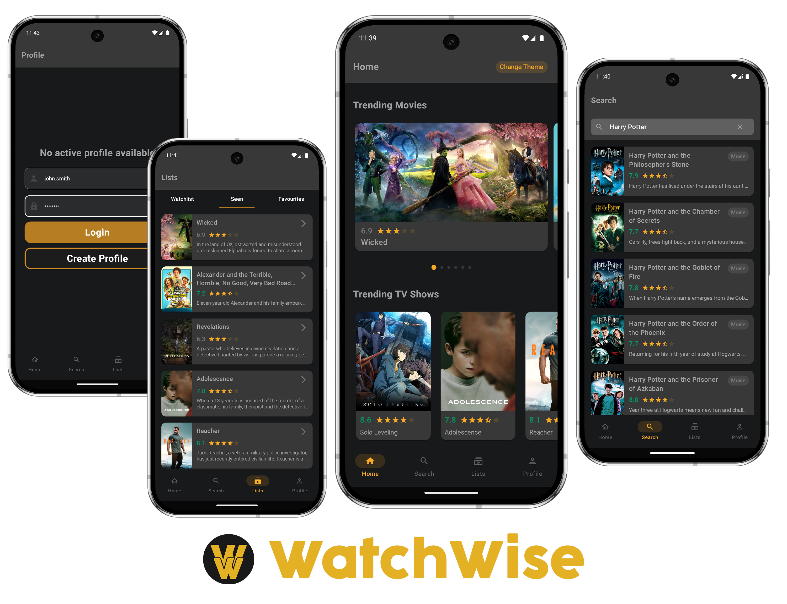

---

# 🎬 WatchWise

**The app to manage your movies, TV shows, and favorite stars!**  
  
WatchWise is a modern Android app built with a multi-module structure, one main activity, and several fragments. It combines local storage (Room) with cloud functionality (Azure Functions) and uses the TMDB API.




### Home Screen Features:
- 🎥 Popular movies & current hits
- 📺 Top-rated and trending TV shows
- 🌟 Popular people and celebrities

Additional Features:
- 🔎 Smart search by title, actor, or director
- 💾 Personal watchlists like "Watched", "Watch Later", "Favorites"
- 👤 Profile screen for personalized listing

---

## 🛠 Architecture & Configuration
- Multi-module architecture
- **MVI pattern** for state management
- **Navigation Component** for fragment navigation
- **Dagger2** for dependency injection
- **Room** for local data persistence
- **Azure Functions** for cloud-based features (user data)

---

## 📚 Used Libraries
| Library         | Purpose                          |
|----------------|----------------------------------|
| Dagger2        | Dependency Injection            |
| Coroutines     | Asynchronous tasks               |
| Room           | Local database                   |
| Retrofit2      | Network communication            |
| Glide          | Image loading                    |

---

## 🚀 Features

### 🔍 Search & Add Movies
- Search by title, director, actor, or genre
- Quickly add titles to your collection

### 🎞 Movie Details & Ratings
- View release dates, plot summaries, cast info
- User ratings with 1–5 stars and comments

### 🗂 Personal Collections & Categories
- Custom lists like "Watched", "Favorites", "Watch Later"
- Suggested categories: Genre-based (Sci-Fi, Comedy...) or Mood-based (Feel-Good, Thrillers...)

---

## ⚙️ Installation & Usage

1. **Get an API Key**
   - Sign up at [TMDB](https://www.themoviedb.org)
   - Add the key to `keystore.properties`:
     ```properties
     THE_MOVIE_DATABASE_API_KEY="your_key"
     ```

2. **Build & Run**
   - Configure using `build.gradle`
   - Run via Android Studio or CLI

---

## 🏪 App Store Description
> **Discover and organize your movie collection like never before!**
>
> With WatchWise, you can easily catalog your films using pre-made categories, create your own lists, and receive personalized recommendations based on your viewing habits.

### Highlights:
- 🎯 **Smart Search** – Find movies, shows & stars with ease
- 📝 **Detailed Info** – Cast, plot, ratings and more
- 🧩 **Custom Categories** – Create your own or use our curated ones
- 💡 **Recommendations & Stats** – Tailored to your interests

---

## 💬 Feedback & Development
Got feedback or ideas? Feel free to open an issue in the repository. We're constantly working on new features and improvements.

---

> _Powered by TMDB · Developed with ❤️ using Kotlin & Azure_
