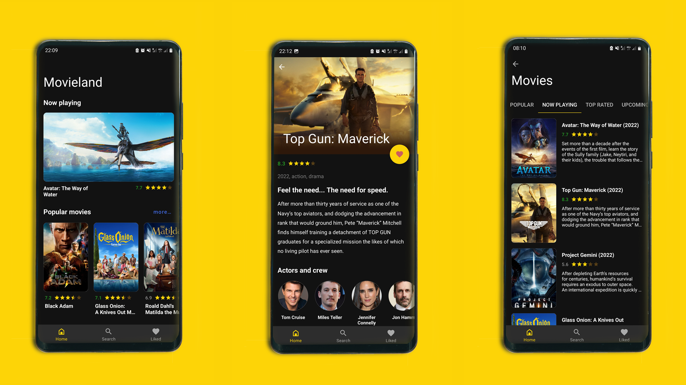
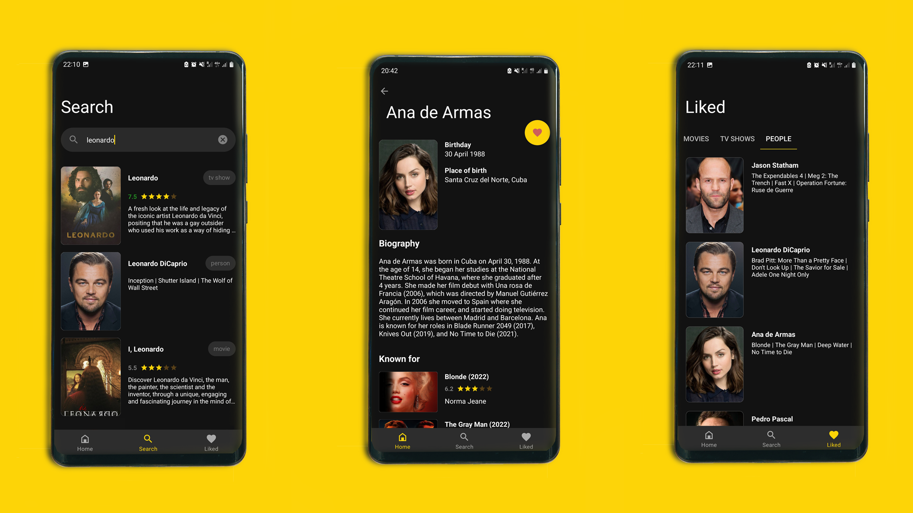

# WatchWise

### An application to search, watch and save movies, TV shows and popular people.

## Description
Multi-module application with one activity and many fragments.

The main screen contains lists of popular movies, TV shows and people. Also a list of now watching movies on the main screen.

After clicking the show more button, screens will open where films (top, popular, etc.), TV shows (top, popular, etc.) and popular people are presented.

It is possible to view detailed information about a movie, TV show or person and add it to favorites.

The search screen allows you to search by movies, TV shows, and people.

The Favorites screen contains your favorite movies, TV shows, and people.

## Configurations
The application is built using command build.gradle.

The app contains an activity that manages fragments.

Used MVI pattern.

A navigation component is used to navigate between fragments.
Dagger2 is used for dependency injection.

***
#### Used libraries:
* **dagger2** - for dependency injection.
* **coroutines** - to perform async tasks.
* **room** - to save data in the database.
* **retrofit2** - to download data from the network.
* **glide** - to upload images.
***

## Usage
An application to search, watch and save movies, TV shows and popular people.

If you want to run the application, then you need to get an api key on the site https://www.themoviedb.org and place "your_key" in keystore.properties in the field THE_MOVIE_DATABASE_API_KEY="your_key"

## TODO list
* add module - Settings
* add statistics
* add profiles
